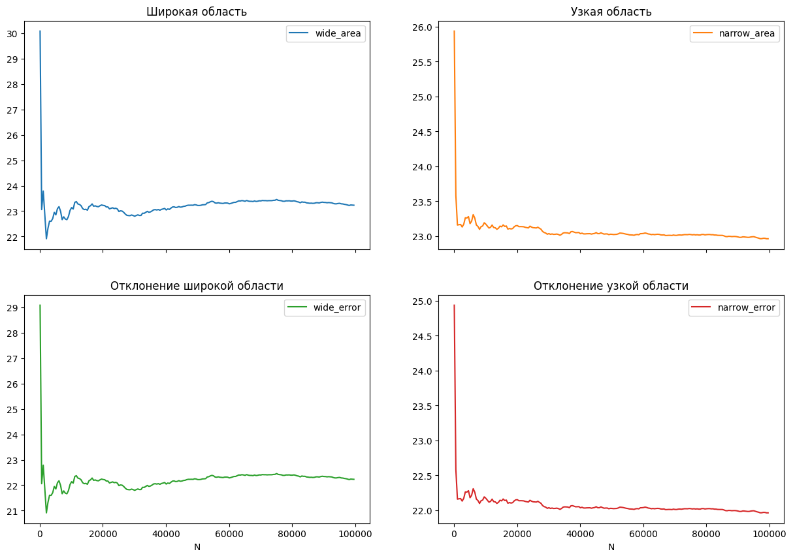

# Отчет по задаче А1

## Выполнил: Бухарин Владислав
## Группа: БПИ249

### Ссылка на [посылку](https://dsahse25.contest.codeforces.com/group/SLdI1pWUpC/contest/647790/submission/349258911)

## Алгоритм

* Реализовал Алгоритм Монте-Карло на C++ с двумя путями:

### путем случайной генерации точек в широкой прямоугольной области, которая охватывает все три круга полностью

```cpp
double estimate_area_wide(std::vector<Circle>circles, int num_points = 100000) {

  double min_x = circles[0].x;
  double max_x = circles[0].x;
  double min_y = circles[0].y;
  double max_y = circles[0].y;
  double max_r = circles[0].r;

  for (int i = 1; i < 3; i++) {
    min_x = std::min(min_x, circles[i].x);
    max_x = std::max(max_x, circles[i].x);
    min_y = std::min(min_y, circles[i].y);
    max_y = std::max(max_y, circles[i].y);
    max_r = std::max(max_r, circles[i].r);
  }

  double left = min_x - max_r;
  double right = max_x + max_r;
  double bottom = min_y - max_r;
  double top = max_y + max_r;
  double square_area = (right - left) * (top - bottom);


  std::mt19937 rng(4131);
  std::uniform_real_distribution<double> dist_x(left, right);
  std::uniform_real_distribution<double> dist_y(bottom, top);

  int count = 0;
  for (int i = 0; i < num_points; i++) {
    double x = dist_x(rng);
    double y = dist_y(rng);

    bool in_all_circles = true;
    for (Circle &circle : circles) {
      double dx = x - circle.x;
      double dy = y - circle.y;
      if (dx * dx + dy * dy >= circle.r * circle.r) {
        in_all_circles = false;
        break;
      }
    }

    if (in_all_circles) {
      count++;
    }
  }

  double area_estimate = (static_cast<double>(count) / num_points) * square_area;
  return area_estimate;
}

```

### путем случайной генерации точек в узкой прямоугольной области, которая более <<плотно>> ограничивает пересечение трех кругов 

```cpp
double estimate_area_narrow(std::vector<Circle> circles, int num_points = 100000) {
  double left = -std::numeric_limits<double>::max();
  double right = std::numeric_limits<double>::max();
  double bottom = -std::numeric_limits<double>::max();
  double top = std::numeric_limits<double>::max();

  for (int i = 0; i < 3; i++) {
    left = std::max(left, circles[i].x - circles[i].r);
    right = std::min(right, circles[i].x + circles[i].r);
    bottom = std::max(bottom, circles[i].y - circles[i].r);
    top = std::min(top, circles[i].y + circles[i].r);
  }

  if (left >= right || bottom >= top) {
    return 0.0;
  }

  double square_area = (right - left) * (top - bottom);


  std::mt19937 rng(4131);
  std::uniform_real_distribution<double> dist_x(left, right);
  std::uniform_real_distribution<double> dist_y(bottom, top);

  int count = 0;
  for (int i = 0; i < num_points; i++) {
    double x = dist_x(rng);
    double y = dist_y(rng);

    bool in_all_circles = true;
    for (Circle &circle : circles) {
      double dx = x - circle.x;
      double dy = y - circle.y;
      if (dx * dx + dy * dy >= circle.r * circle.r) {
        in_all_circles = false;
        break;
      }
    }

    if (in_all_circles) {
      count++;
    }
  }

  double area_estimate = (static_cast<double>(count) / num_points) * square_area;
  return area_estimate;
}

```


* Сами эксперементы запускал так

```cpp

#include "task1.cpp"
#include <fstream>
#include <iostream>

#include <vector>

void write_results() {
  // Пример это 3 одинаковых круга, центры которых находятся на вершинах одного равностороннего треугольника
  double R = 4.5;
  double tryangle_length = 3.5;
  std::vector<Circle> circles;
  circles.push_back(Circle(0, 0, R));
  circles.push_back(Circle(tryangle_length, 0, R));
  circles.push_back(Circle(tryangle_length / 2.0, tryangle_length * sqrt(3) / 2, R));
  // S = 3 *  S_сегмента + S_треугольника
  double theta = 2.0 * acos(tryangle_length / (2.0 * R));
  double segment_area = 0.5 * R * R * (theta - sin(theta));
  double triangle_area = (sqrt(3) / 4.0) * tryangle_length * tryangle_length;
  double correct_S = 3.0 * segment_area + triangle_area;

  std::ofstream file("/Users/vladbax6/Codding/code_works/cpp/AISDSet1/results.csv");
  file << std::fixed << std::setprecision(15);
  file << "N,wide_area,narrow_area,wide_error,narrow_error\n";

  for (int n = 100; n <= 100000; n += 500) {
    double wide_area = estimate_area_wide(circles, n);
    double narrow_area = estimate_area_narrow(circles, n);

    double wide_error = wide_area - correct_S / correct_S;
    double narrow_error = narrow_area - correct_S / correct_S;

    file << n << "," << wide_area << "," << narrow_area << ","
         << wide_error << "," << narrow_error << "\n";
  }

  file.close();
}

int main() {

  write_results();

  return 0;
}
```

* В итоге получил данные и построил график с поомщью кода на питоне 

```py
import pandas as pd
df = pd.read_csv("results.csv")
df.plot(x='N',
        y=['wide_area', 'narrow_area', 'wide_error', 'narrow_error'],
        subplots=True,
        layout=(2, 2),
        figsize=(15, 10),
        title=['Широкая область', 'Узкая область', 'Отклонение широкой области', 'Отклонение узкой области'])

```



## Вывод: 
* Проведенные эксперименты демонстрируют, что с повышением количества точек N ошибка вычислений уменьшается, а точность приближенного значения площади возрастает. Оба алгоритма показывают сходимость к точному значению, при этом метод с узкой областью генерации демонстрирует более быструю сходимость благодаря меньшему объему области генерации случайных точек.

