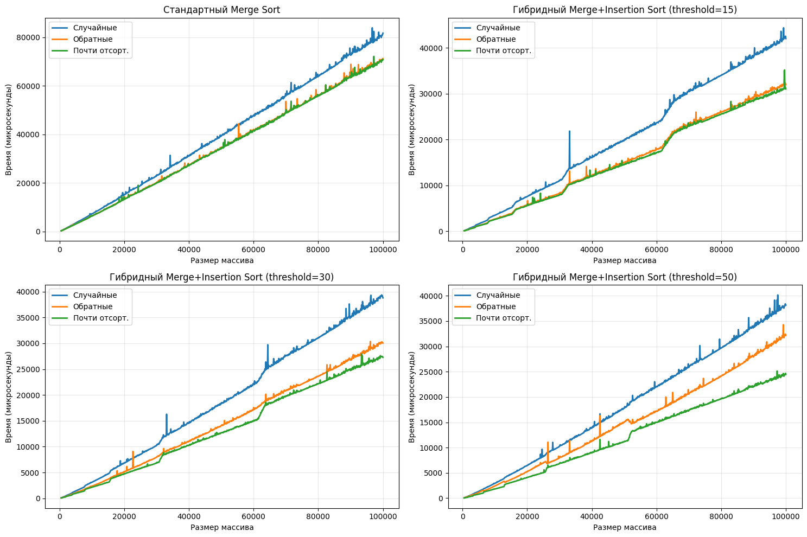

# Отчет по задаче А2

## Выполнил: Бухарин Владислав
## Группа: БПИ249

### Ссылка на [посылку](https://dsahse25.contest.codeforces.com/group/SLdI1pWUpC/contest/647790/submission/349351171)
### Ссылка на [репозиторий с результатми](https://github.com/HghaVlad/AisdHW/)


## Алгоритм

* Реализовал стандартный merge sort

```cpp
void merge(std::vector<int> &arr, int left, int mid, int right) {
  int n1 = mid - left + 1;
  int n2 = right - mid;

  std::vector<int> leftArr(n1), rightArr(n2);

  for (int i = 0; i < n1; i++)
    leftArr[i] = arr[left + i];
  for (int j = 0; j < n2; j++)
    rightArr[j] = arr[mid + 1 + j];

  int i = 0, j = 0, k = left;

  while (i < n1 && j < n2) {
    if (leftArr[i] <= rightArr[j]) {
      arr[k] = leftArr[i];
      i++;
    } else {
      arr[k] = rightArr[j];
      j++;
    }
    k++;
  }

  while (i < n1) {
    arr[k] = leftArr[i];
    i++;
    k++;
  }

  while (j < n2) {
    arr[k] = rightArr[j];
    j++;
    k++;
  }
}
static void mergeSort(std::vector<int> &arr, int left, int right) {
  if (left >= right) return;

  int mid = left + (right - left) / 2;
  mergeSort(arr, left, mid);
  mergeSort(arr, mid + 1, right);
  merge(arr, left, mid, right);
}


```


* Улучшил его добавив включение Insertion Sort при достижении  определенного размера массива 

```cpp
void insertionSort(std::vector<int> &arr, int left, int right) {
  for (int i = left + 1; i <= right; i++) {
    int key = arr[i];
    int j = i - 1;
    while (j >= left && arr[j] > key) {
      arr[j + 1] = arr[j];
      j--;
    }
    arr[j + 1] = key;
  }
}

void hybridMergeSort(std::vector<int> &arr, int left, int right, int threshold) {
  if (left >= right) return;

  if (right - left + 1 <= threshold) {
    insertionSort(arr, left, right);
  } else {
    int mid = left + (right - left) / 2;
    hybridMergeSort(arr, left, mid, threshold);
    hybridMergeSort(arr, mid + 1, right, threshold);
    merge(arr, left, mid, right);
  }
}
```

* Провел эксперимент, экспортируя результаты в два файла standart_results.csv и hybrid_results.csv
* Написал скрипт на python для отображения графиков

```py
import pandas as pd
import matplotlib.pyplot as plt


standard_df = pd.read_csv('standard_results.csv')
hybrid_df = pd.read_csv('hybrid_results.csv')
fig, axes = plt.subplots(2, 2, figsize=(15, 10))

axes[0, 0].plot(standard_df['size'], standard_df['random'], label='Случайные', linewidth=2)
axes[0, 0].plot(standard_df['size'], standard_df['reversed'], label='Обратные', linewidth=2)
axes[0, 0].plot(standard_df['size'], standard_df['almost_sorted'], label='Почти отсорт.', linewidth=2)
axes[0, 0].set_title('Стандартный Merge Sort')
axes[0, 0].set_xlabel('Размер массива')
axes[0, 0].set_ylabel('Время (микросекунды)')
axes[0, 0].legend()
axes[0, 0].grid(True, alpha=0.3)

hybrid_15 = hybrid_df[hybrid_df['threshold'] == 15]
axes[0, 1].plot(hybrid_15['size'], hybrid_15['random'], label='Случайные', linewidth=2)
axes[0, 1].plot(hybrid_15['size'], hybrid_15['reversed'], label='Обратные', linewidth=2)
axes[0, 1].plot(hybrid_15['size'], hybrid_15['almost_sorted'], label='Почти отсорт.', linewidth=2)
axes[0, 1].set_title('Гибридный Merge+Insertion Sort (threshold=15)')
axes[0, 1].set_xlabel('Размер массива')
axes[0, 1].set_ylabel('Время (микросекунды)')
axes[0, 1].legend()
axes[0, 1].grid(True, alpha=0.3)

hybrid_30 = hybrid_df[hybrid_df['threshold'] == 30]
axes[1, 0].plot(hybrid_30['size'], hybrid_30['random'], label='Случайные', linewidth=2)
axes[1, 0].plot(hybrid_30['size'], hybrid_30['reversed'], label='Обратные', linewidth=2)
axes[1, 0].plot(hybrid_30['size'], hybrid_30['almost_sorted'], label='Почти отсорт.', linewidth=2)
axes[1, 0].set_title('Гибридный Merge+Insertion Sort (threshold=30)')
axes[1, 0].set_xlabel('Размер массива')
axes[1, 0].set_ylabel('Время (микросекунды)')
axes[1, 0].legend()
axes[1, 0].grid(True, alpha=0.3)

hybrid_50 = hybrid_df[hybrid_df['threshold'] == 50]
axes[1, 1].plot(hybrid_50['size'], hybrid_50['random'], label='Случайные', linewidth=2)
axes[1, 1].plot(hybrid_50['size'], hybrid_50['reversed'], label='Обратные', linewidth=2)
axes[1, 1].plot(hybrid_50['size'], hybrid_50['almost_sorted'], label='Почти отсорт.', linewidth=2)
axes[1, 1].set_title('Гибридный Merge+Insertion Sort (threshold=50)')
axes[1, 1].set_xlabel('Размер массива')
axes[1, 1].set_ylabel('Время (микросекунды)')
axes[1, 1].legend()
axes[1, 1].grid(True, alpha=0.3)

plt.tight_layout()
plt.show()

```



## Выводы
- Гибридный алгоритм превосходит стандартный Merge Sort на всех типах тестовых данных
- Основное преимущество достигается за счет замены рекурсивных вызовов на эффективную сортировку вставками для малых подмассивов
- Наибольший выигрыш наблюдается на почти отсортированных данных, где Insertion Sort проявляет свои сильные стороны
- Также заметно что чем выше thresold тем быстрее выполняется сортировка 
